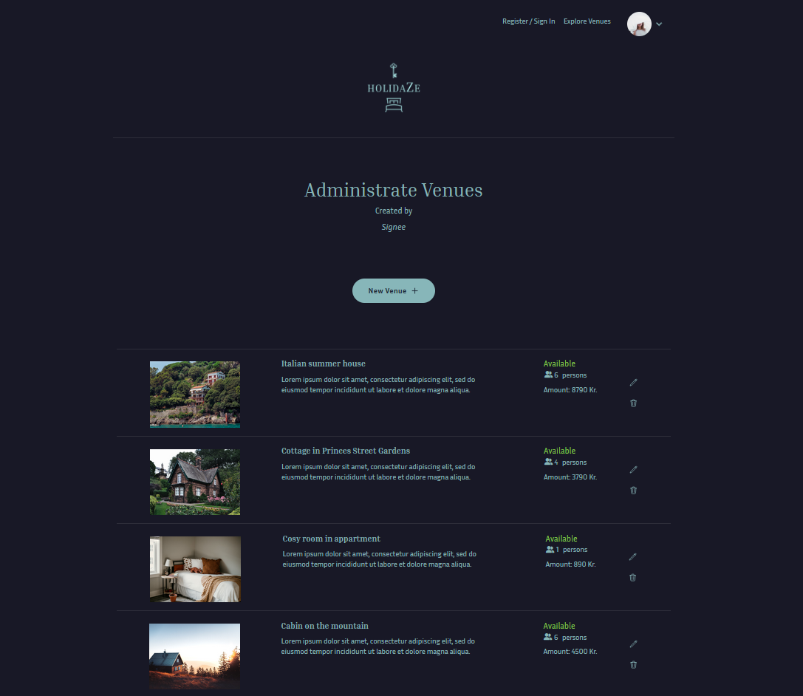

# Holidaze Accommodation Platform



This project is a front-end application for the Holidaze accommodation booking site, developed as part of my exam project for Noroff School of Technology and Digital Media.

## Overview

Holidaze is a modern platform that allows users to book holiday accommodations and enables venue managers to manage venues and bookings. The application is built with **React**, **Vite**, **Tailwind CSS**, and **DaisyUI**, integrating the Holidaze API for all backend functionality.

### Features

- **User Features**:

  - View a list of venues.
  - Search for specific venues.
  - View detailed venue pages with a calendar for availability.
  - Register as a customer to book venues.

- **Customer Features**:

  - Book venues.
  - View ones upcoming bookings.
  - Update profile avatar, banner and profile description.

- **Venue Manager Features**:

  - Register as a venue manager.
  - Create, update, and delete venues.
  - View and manage bookings for their venues.

- **Authentication**:
  - Register and login with `stud.noroff.no` email addresses.
  - Secure logout.

## Tech Stack

### Core Technologies

- **Framework**: React with Vite for fast development and build.
- **Styling**: Tailwind CSS and DaisyUI for a modern, responsive design.

### Libraries and Tools

- **State Management**: Zustand for lightweight state management.
- **Forms & Validation**: React Hook Form and Yup for handling user inputs and validations.
- **Routing**: React Router DOM for navigation and routing.
- **Calendar**: React Calendar and React Datepicker for date selection and availability.
- **Linting and Formatting**: ESLint and Prettier for code quality and consistency.

## Installation

### Prerequisites

- Node.js (v16 or higher) and npm installed on your machine.

### Steps

1. Clone the repository:

```bash
  git clone https://github.com/Sirvau/project-exam-2.git
```

2. Install dependencies:

```bash
  npm install
```

3.  Start the development server:

```bash
  npm run dev
```

### Scripts

**npm run dev:** Start the development server.
**npm run build:** Build the application for production.
**npm run lint:** Run ESLint to check for code issues.
**npm run lint:fix:** Fix linting issues automatically.
**npm run format:** Format the codebase with Prettier.

## Deployment

[Holidaze](https://myholidaze.netlify.app/)
[](https://app.netlify.com/sites/myholidaze/deploys)

## Acknowledgments

Special thanks to the Noroff School of Technology and Digital Media for providing the resources and API for this project.

## Author

Siril O. Vaular
[@Sirvau](https://github.com/Sirvau)
